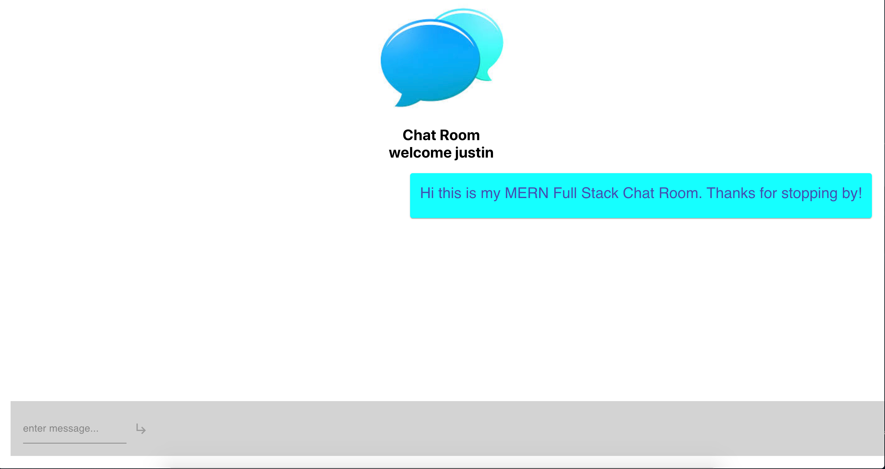

# MERN-messenger
MERN-messenger is a chatroom where friends can chat together and see messages slide in in real time.  

### `Description`
This Full Stack app is a simple place for friends to come and chat.  Messages are updated in real time and placed based on who wrote them. All messages are saved in the database.

### `Demo`
click link for short demo of app
https://drive.google.com/file/d/15IHu1W7PdKMv9nWlXutpMEhLoRjwXT7V/view

### `Technologies used`

This is a Full Stack app using the MERN stack
- MongoDB
- Express.js
- React
- Node.js

Also used libraries such as
- FlipMove for real time message update
- Firebase for hosting
- Pusher for pushing message from frontend to backend

### `Contributors`

Justin Suderman
Follow me @JSuderman on Github

